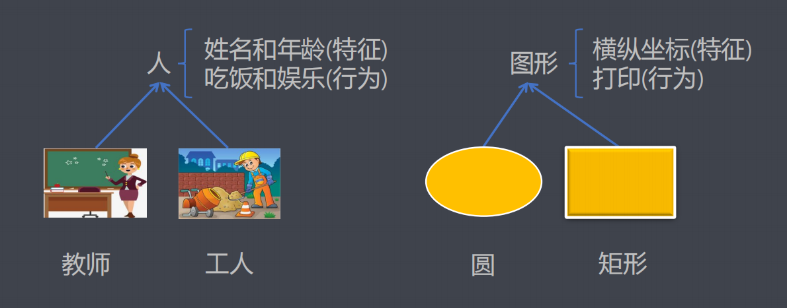
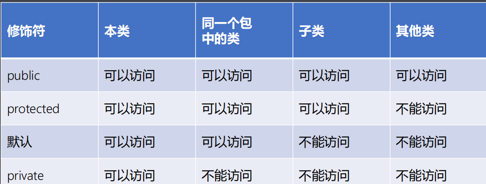

# **static**关键字和继承

## **第一节：**static关键字（重点）

**基本概念**

• 使用static关键字修饰成员变量表示静态的含义，此时成员变量由对象层级提升为类层级，也就是整个类只有一份并被所有对象共享，该成员变量随着类的加载准备就绪，与是否创建对象无关。

• static关键字修饰的成员可以使用引用.的方式访问，但推荐类名.的方式。

**使用方式**

• 在非静态成员方法中既能访问非静态的成员又能访问静态的成员。(成员：成员变量 + 成员方法， 静态成员被所有对象共享) 

• 在静态成员方法中只能访问静态成员不能访问非静态成员。(成员：成员变量 + 成员方法， 因为此时可能还没有创建对象) 

• 在以后的开发中只有隶属于类层级并被所有对象共享的内容才可以使用static关键字修饰。(不能滥用static关键字)

**构造块和静态代码块（**熟悉）

• 构造块：在类体中直接使用{}括起来的代码块。

• 每创建一个对象都会执行一次构造块。 

• 静态代码块：使用static关键字修饰的构造块。

• 静态代码块随着类加载时执行一次。

**又见**main方法

• 语法格式：

```java
public static void main(String[] args){}
```

**单例设计模式的概念**

• 在某些特殊场合中，一个类对外提供且只提供一个对象时，这样的类叫做单例类，而设计单例的流程和思想叫做单例设计模式。

**单例设计模式的实现流程**

• 私有化构造方法，使用private关键字修饰。 

• 声明本类类型的引用指向本类类型的对象，并使用private static关键字共同修饰。

• 提供公有的get方法负责将对象返回出去，并使用public static关键字共同

修饰。

**单例设计模式的实现方式**

• 单例设计模式的实现方式有两种：饿汉式 和 懒汉式，在以后的开发中推荐饿汉式。

## **第二节：继承（**重中之重）继承的由来



**继承的概念**

• 当多个类之间有相同的特征和行为时，可以将相同的内容提取出来组成一个公共类，让多个类吸收公共类中已有特征和行为而在多个类型只需要编写自己独有特征和行为的机制，叫做继承。

**继承的概念**

• 在Java语言中使用extends(扩展)关键字来表示继承关系。 

• 如：

public class Worker extends Person{} - 表示Worker类继承自Person类

其中Person类叫做超类、父类、基类。

其中Worker类叫做派生类、子类、孩子类。 

• 使用继承提高了代码的复用性，可维护性及扩展性，是多态的前提条件。

**继承的特点**

• 子类不能继承父类的构造方法和私有方法，但私有成员变量可以被继承只是不能直接访问。

• 无论使用何种方式构造子类的对象时都会自动调用父类的无参构造方法，来初始化从父类中继承的成员变量，相当于在构造方法的第一行增加代 码super()的效果。

**继承的特点**

• 使用继承必须满足逻辑关系：子类 is a 父类，也就是不能滥用继承。

• Java语言中只支持单继承不支持多继承，也就是说一个子类只能有一个父类，但一个父类可以有多个子类。

**方法重写的概念**

• 从父类中继承下来的方法不满足子类的需求时，就需要在子类中重新写一个和父类一样的方法来覆盖从父类中继承下来的版本，该方式就叫做方法的重写（Override）。

**方法重写的原则**

• 要求方法名相同、参数列表相同以及返回值类型相同，从Java5开始允许返回子类类型。

• 要求方法的访问权限不能变小，可以相同或者变大。

• 要求方法不能抛出更大的异常(异常机制)

补充：

**又见构造块与静态代码块（**笔试****）

• 先执行父类的静态代码块，再执行子类的静态代码块。

• 执行父类的构造块，执行父类的构造方法体。

• 执行子类的构造块，执行子类的构造方法体。

## **第三节：访问控制**常用的访问控制符

**常用的访问控制符**



**注意事项**

• public修饰的成员可以在任意位置使用。

• private修饰的成员只能在本类内部使用。

• 通常情况下，成员方法都使用public关键字修饰，成员变量都使用private

关键字修饰。

**package**语句的由来

• 定义类时需要指定类的名称，但如果仅仅将类名作为类的唯一标识，则不可避免的出现命名冲突的问题。这会给组件复用以及团队间的合作造成很大的麻烦！ 

• 在Java语言中，用包（package）的概念来解决命名冲突的问题。

**包的定义**

• 在定义一个类时，除了定义类的名称一般还要指定一个包名，格式如下：

package 包名; 

package 包名1.包名2.包名3...包名n; 

• 为了实现项目管理、解决命名冲突以及权限控制的效果。

**定义包的规范**

• 如果各个公司或开发组织的程序员都随心所欲的命名包名的话，仍然不从根本上解决命名冲突的问题。因此，在指定包名的时候应该按照一定的规范。 

• org.apache.commons.lang.StringUtil

• 其中StringUtils是类名而org.apache.commons.lang是多层包名，其含义如下：org.apache表示公司或组织的信息（是这个公司（或组织）域名的反写）；common 表示项目的名称信息；lang 表示模块的名称信息。

**包的导入**

• 使用import关键字导入包。

• 使用import关键字导入静态成员，从Java5.0开始支持。

## **第四节：**final关键字（重点）基本概念

• final本意为"最终的、不可改变的"，可以修饰类、成员方法以及成员变量。

**使用方式**

• final关键字修饰类体现在该类不能被继承。

主要用于防止滥用继承，如：java.lang.String类等。

• final关键字修饰成员方法体现在该方法不能被重写但可以被继承。

主要用于防止不经意间造成重写，如：java.text.Dateformat类中format方法等。

• final关键字修饰成员变量体现在该变量必须初始化且不能改变。

主要用于防止不经意间造成改变，如：java.lang.Thread类中MAX_PRIORITY等。

**常量的概念**

• 在以后的开发中很少单独使用final关键字来修饰成员变量，通常使用**public static final**关键字共同修饰成员变量来表达常量的含义，常量的命名规范要求是所有字母都要大写，不同的单词之间采用下划线连。 

• public static final double PI = 3.14;