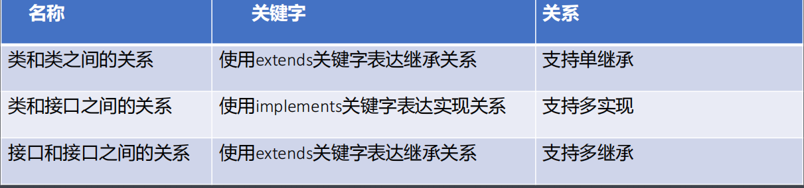

# **多态和特殊类**

## **第一节：多态（**重中之重****）****多态的概念

• 多态主要指同一种事物表现出来的多种形态。

• 饮料：可乐、雪碧、红牛、脉动、... 

• 宠物：猫、狗、鸟、小强、鱼、...

• 人：学生、教师、工人、保安、...

• 图形：矩形、圆形、梯形、三角形、…

**多态的语法格式**

• 父类类型 引用变量名 = new 子类类型();

• 如：

```java
Shape sr = new Rect();

sr.show();
```

**案例题目**

• 编程实现Shape类的封装，特征有：横纵坐标，要求提供打印所有特征的方法。

• 编程实现Rect类的封装并继承自Shape类，特征有：长度和宽度。

• 编程实现ShapeRectTest类，在main方法中分别创建Shape和Rect类型对象并打印特征。

**多态的特点**

• 当父类类型的引用指向子类类型的对象时，父类类型的引用可以直接调用父类独有的方法。

• 当父类类型的引用指向子类类型的对象时，父类类型的引用不可以直接调用子类独有的方法。

• 对于父子类都有的非静态方法来说，编译阶段调用父类版本，运行阶段调用子类重写的版本（动态绑定）。

• 对于父子类都有的静态方法来说，编译和运行阶段都调用父类版本。

**引用数据类型之间的转换**

• 引用数据类型之间的转换方式有两种：自动类型转换 和强制类型转换。

• 自动类型转换主要指小类型向大类型的转换，也就是子类转为父类，也叫做向上转型。

• 强制类型转换主要指大类型向小类型的转换，也就是父类转为子类，也叫做向下转型或显式类型转换。

• 引用数据类型之间的转换必须发生在父子类之间，否则编译报错。

**引用数据类型之间的转换**

• 若强转的目标类型并不是该引用真正指向的数据类型时则编译通过，运行阶段发生类型转换异常。

• 为了避免上述错误的发生，应该在强转之前进行判断，格式如下：

if(引用变量 instanceof 数据类型) 

判断引用变量指向的对象是否为后面的数据类型

**多态的实际意义**

• 多态的实际意义在于屏蔽不同子类的差异性实现通用的编程带来不同的效果。

## **第二节：抽象类（**重点）抽象方法的概念

• 抽象方法主要指不能具体实现的方法并且使用abstract关键字修饰，也就是没有方法体。

• 具体格式如下：

访问权限 abstract 返回值类型 方法名(形参列表); 

public abstract void cry();

**抽象类的概念**

• 抽象类主要指不能具体实例化的类并且使用abstract关键字修饰，也就是不能创建对象。

**抽象类和抽象方法的关系**

• 抽象类中可以有成员变量、构造方法、成员方法；

• 抽象类中可以没有抽象方法，也可以有抽象方法；

• 拥有抽象方法的类必须是抽象类，因此真正意义上的抽象类应该是具有抽象方法并且使用abstract关键字修饰的类。

**抽象类的实际意义**

• 抽象类的实际意义不在于创建对象而在于被继承。

• 当一个类继承抽象类后必须重写抽象方法，否则该类也变成抽象类，也就是抽象类对子类具有强制性和规范性，因此叫做模板设计模式。

**开发经验分享**

• 在以后的开发中推荐使用多态的格式，此时父类类型引用直接调用的所有方法一定是父类中拥有的方法，若以后更换子类时，只需要将new关键字后面的子类类型修改而其它地方无需改变就可以立即生效，从而提高了代码的可维护性和可扩展型。

• 该方式的缺点就是：父类引用不能直接调用子类独有的方法，若调用则需要强制类型转换。

**抽象类的应用**

• 银行有 定期账户和活期账户。继承自 账户类。账户类中：

```java
public class Account{

private double money;

public double getLixi(){}

}
```


## **第三节：接口（**重点）接口的基本概念

• 接口就是一种比抽象类还抽象的类，体现在所有方法都为抽象方法。

• 定义类的关键字是class，而定义接口的关键字是interface。 

**练习题目**

• 编程实现Runner接口，提供一个描述奔跑行为的抽象方法。

• 编程实现Hunter接口继承Runner接口，并提供一个描述捕猎行为的抽象方法。

• 编程实现Man类实现Hunter接口并重写抽象方法，在main方法中使用多

态方式测试。

**类和接口之间的关系**



- 所谓**多**继承**是指一个子类可以拥有多个父类；**单继承则是一个子类只拥有一个父类。

**抽象类和接口的主要区别（**笔试题****）

• 定义抽象类的关键字是abstract class，而定义接口的关键字是interface。 

• 继承抽象类的关键字是extends，而实现接口的关键字是implements。 

• 继承抽象类支持单继承，而实现接口支持多实现。

• 抽象类中可以有构造方法，而接口中不可以有构造方法。

• 抽象类中可以有成员变量，而接口中只可以有常量。

**抽象类和接口的主要区别**

• 抽象类中可以有成员方法，而接口中只可以有抽象方法。

• 抽象类中增加方法时子类可以不用重写，而接口中增加方法时实现类需要重写（Java8以前的版本）。

• 从Java8开始增加新特性，接口中允许出现非抽象方法和静态方法，但非抽象方法需要使用default关键字修饰。 

• 从Java9开始增加新特性，接口中允许出现私有方法。