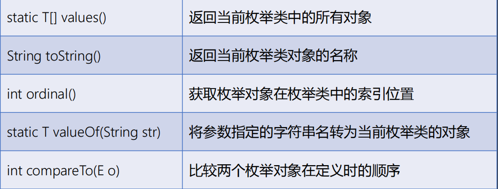
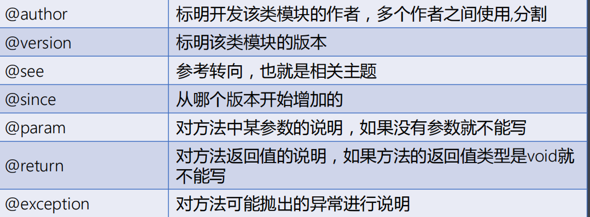

# 特殊类

## **第一节：内部类（**熟悉）

内部类的基本概念

• 当一个类的定义出现在另外一个类的类体中时，那么这个类叫做内部类（Inner），而这个内部类所在的类叫做外部类（Outer）。

• 类中的内容：成员变量、成员方法、构造方法、静态成员、构造块和静态代码块、内部类。

**实际作用**

• 当一个类存在的价值仅仅是为某一个类单独服务时，那么就可以将这个类定义为所服务类中的内部类，这样可以隐藏该类的实现细节并且可以方便的访问外部类的私有成员而不再需要提供公有的get和set方法。

**内部类的分类**

• 普通内部类 - 直接将一个类的定义放在另外一个类的类体中。

• 静态内部类 - 使用static关键字修饰的内部类，隶属于类层级。

• 局部内部类 - 直接将一个类的定义放在方法体的内部时。 

• 匿名内部类 - 就是指没有名字的内部类。

**普通（成员）内部类的格式**

```java
访问修饰符 class 外部类的类名 {

访问修饰符 class 内部类的类名 { 

内部类的类体;

        } 
  }
```

 **普通内部类的使用方式**

• 普通内部类和普通类一样可以定义成员变量、成员方法以及构造方法等。

• 普通内部类和普通类一样可以使用final或者abstract关键字修饰。

• 普通内部类还可以使用private或protected关键字进行修饰。

• 普通内部类需要使用外部类对象来创建对象。

• 如果内部类访问外部类中与本类内部同名的成员变量或方法时，需要使

用this关键字。

**静态内部类的格式**

```
访问修饰符 class 外部类的类名 {

访问修饰符 static class 内部类的类名 { 

内部类的类体;

     } 
}
```

 **静态内部类的使用方式**

• 静态内部类不能直接访问外部类的非静态成员。

• 静态内部类可以直接创建对象。

• 如果静态内部类访问外部类中与本类内同名的成员变量或方法时，需要使用类名.的方式访问。

**局部（方法）内部类的格式**

```
• 访问修饰符 class 外部类的类名 {

访问修饰符 返回值类型 成员方法名（形参列表） {

class 内部类的类名 { 

内部类的类体; 

    }

  } 

} 
```

**局部内部类的使用方式**

• 局部内部类只能在该方法的内部可以使用。

• 局部内部类可以在方法体内部直接创建对象。

• 局部内部类不能使用访问控制符和static关键字修饰符。

• 局部内部类可以使用外部方法的局部变量，但是必须是final的。由局部内

部类和局部变量的声明周期不同所致。

**回调模式的概念**

• 回调模式是指——如果一个方法的参数是接口类型，则在调用该方法时，需要创建并传递一个实现此接口类型的对象；而该方法在运行时会调用到参数对象中所实现的方法（接口中定义的）。

**开发经验分享**

• 当接口类型的引用作为方法的形参时，实参的传递方式有两种： 

• 自定义类实现接口/继承类并重写方法，然后创建该类对象作为实参传递；

• 使用上述匿名内部类的语法格式得到接口/类类型的引用即可；

**匿名内部类的语法格式（**重点）

• 接口/父类类型 引用变量名 = new 接口/父类类型() { 方法的重写 };

## **第二节：枚举（**熟悉）枚举的基本概念

• 一年中的所有季节：春季、夏季、秋季、冬季。

• 所有的性别：男、女。

• 键盘上的所有方向按键：向上、向下、向左、向右。

• 在日常生活中这些事物的取值只有明确的几个固定值，此时描述这些事物的所有值都可以一一列举出来，而这个列举出来的类型就叫做枚举类型。

**枚举的定义**

• 使用public static final表示的常量描述较为繁琐，使用enum关键字来定义枚举类型取代常量，枚举类型是从Java5开始增加的一种引用数据类型。

• 枚举值就是当前类的类型，也就是指向本类的对象，默认使用public static final关键字共同修饰，因此采用枚举类型.的方式调用。

• 枚举类可以自定义构造方法，但是构造方法的修饰符必须是private，默认也是私有的。

**Enum**类的概念和方法

• 所有的枚举类都继承自java.lang.Enum类，常用方法如下：static T[] values() 



**枚举类实现接口的方式**

• 枚举类实现接口后需要重写抽象方法，而重写方法的方式有两种：重写一个，或者每个对象都重写。

## **第三节：注解（**重点）注解的基本概念

• 注解（Annotation）又叫标注，是从Java5开始增加的一种引用数据类型。

• 注解本质上就是代码中的特殊标记，通过这些标记可以在编译、类加载、以及运行时执行指定的处理。

**注解的语法格式**

```
访问修饰符 @interface 注解名称 {

注解成员; 

} 
```

• 自定义注解自动继承java.lang.annotation.Annotation接口。 

• 通过@注解名称的方式可以修饰包、类、 成员方法、成员变量、构造方

法、参数、局部变量的声明等。

**注解的使用方式**

• 注解体中只有成员变量没有成员方法，而注解的成员变量以“无形参的方法”形式来声明，其方法名定义了该成员变量的名字，其返回值定义了该成员变量的类型。

• 如果注解只有一个参数成员，建议使用参数名为value，而类型只能是八种基本数据类型、String类型、Class类型、enum类型及Annotation类型。

**元注解的概念**

• 元注解是可以注解到注解上的注解，或者说元注解是一种基本注解，但是它能够应用到其它的注解上面。 

• 元注解主要有 @Retention、@Documented、@Target、@Inherited、 @Repeatable。

**元注解**@Retention

• @Retention 应用到一个注解上用于说明该注解的的生命周期，取值如下：

1.  RetentionPolicy.SOURCE 注解只在源码阶段保留，在编译器进行编译时它将被丢弃忽视。
2. RetentionPolicy.CLASS 注解只被保留到编译进行的时候，它并不会被加载到 JVM 中，默认方式。
3.  RetentionPolicy.RUNTIME 注解可以保留到程序运行的时候，它会被加载进入到 JVM 中，所以在程序运行时可以获取到它们。

**元注解**@Documented

• 使用javadoc工具可以从程序源代码中抽取类、方法、成员等注释形成一个和源代码配套的API帮助文档，而该工具抽取时默认不包括注解内容。

• @Documented用于指定被该注解将被javadoc工具提取成文档。 

• 定义为@Documented的注解必须设置Retention值为RUNTIME。

**元注解**@Target

• @Target用于指定被修饰的注解能用于哪些元素的修饰，取值如下：

1. ElementType.ANNOTATION_TYPE 可以给一个注解进行注解
2. ElementType.CONSTRUCTOR 可以给构造方法进行注解
3. ElementType.FIELD 可以给属性进行注解
4. ElementType.LOCAL_VARIABLE 可以给局部变量进行注解
5. ElementType.METHOD 可以给方法进行注解
6. ElementType.PACKAGE 可以给一个包进行注解
7. ElementType.PARAMETER 可以给一个方法内的参数进行注解
8. ElementType.TYPE 可以给类型进行注解，比如类、接口、枚举

**元注解**@Inherited

• @Inherited并不是说注解本身可以继承，而是说如果一个超类被该注解标记过的注解进行注解时，如果子类没有被任何注解应用时，则子类就继承超类的注解。

**元注解**@Repeatable

• @Repeatable表示自然可重复的含义，从Java8开始增加的新特性。 

• 从Java8开始对元注解@Target的参数类型ElementType枚举值增加了两个： 

• 其中ElementType.TYPE_PARAMETER 表示该注解能写在类型变量的声明语句中，如：泛型。

• 其中ElementType.TYPE_USE 表示该注解能写在使用类型的任何语句中。

**常见的预制注解**

