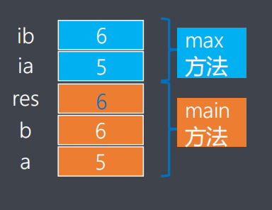

# **类和对象**

## ***第一节：面向对象编程（理解******）***

***面向对象编程的概念***

- 万物皆对象。
- 面向对象指以属性和行为的观点去分析现实生活中的事物。
- 面向对象编程指先以面向对象的思想进行分析，然后使用面向对象的编程语言
- 进行表达的过程。
- 面向对象编程是软件产业化发展的需求。
- 理解面向对象的思想精髓佳寸装、继承、多态），至少掌握一种编程语言。


## ***第二节:类和对象及引用（******重中之重******）***

***类和对象的概念***

- 对象主要指现实生活中客观存在的实体，在Java语言中对象体现为内存空间中的一块存储区域。
- 类简单来就是“分类”，是对具有相同特征和行为的多个对象共性的抽象描述，在Java语言中体现为一种弓I用数据类型，里面包含了描述特征/属性 的成员变量以及描述行为的成员方法。
- 类是用于构建对象的模板，对象的数据结构由定义它的类来决定。

***类的定义***

```java
class 类名 {

类体;

} 
```

- 注意：

通常情况下，当类名由多个单词组成时，要求每个单词首字母都要大写

**成员变量的定义**

```java
• class 类名 {

数据类型 成员变量名 = 初始值; 

} 
```

- 注意：

当成员变量由多个单词组成时，通常要求从第二个单词起每个单词的首字母大写 。

**对象的创建**

```java
• new 类名();
```

• 注意：

- 当一个类定义完毕后，可以使用new关键字来创建该类的对象，这个过程叫做类的实例化。
- 创建对象的本质就是在内存空间的堆区申请一块存储区域， 用于存放该对象独有特征信息。

**引用的定义**

• 基本概念

- 使用引用数据类型定义的变量叫做引用型变量，简称为"引用"。
- 引用变量主要用于记录对象在堆区中的内存地址信息，便于下次访问。

• 语法格式

类名 引用变量名;

引用变量名.成员变量名;

```java
Person p = new Person();

p.name = "张飞";

System.out.println(p.name);
```

##  **第三节：成员方法（**重中之重）

**成员方法的定义**

```java
• class 类名 {

返回值类型 成员方法名(形参列表) {

成员方法体; 

   } 

} 

```

注意：

- 当成员方法名由多个单词组成时，要求从第二个单词起每个单词的首字母大写。

```java
class Person {

void show() {

System.out.println("没事秀一下！");
    } 
}
```

**返回值类型的详解**

• 返回值主要指从方法体内返回到方法体外的数据内容。

• 返回值类型主要指返回值的数据类型，可以是基本数据类型，也可以是引用数据类型。

• 当返回的数据内容是66时，则返回值类型写 int 即可 

• 在方法体中使用return关键字可以返回具体的数据内容并结束当前方法。

• 当返回的数据内容是66时，则方法体中写 return 66; 即可

• 当该方法不需要返回任何数据内容时，则返回值类型写void即可

**形参列表的详解**

• 形式参数主要用于将方法体外的数据内容带入到方法体内部。

• 形式参数列表主要指多个形式参数组成的列表，语法格式如：数据类型 形参变量名1, 数据类型 形参变量名2, ... 

• 当带入的数据内容是"hello"时，则形参列表写 String s 即可

• 当带入的数据内容是66和"hello"时，则形参列表写 int i, String s 即可

• 若该方法不需要带入任何数据内容时，则形参列表位置啥也不写即可。

**方法体的详解**

• 成员方法体主要用于编写描述该方法功能的语句块。

• 成员方法可以实现代码的重用，简化代码。

**方法的调用**

• 引用变量名.成员方法名(实参列表);

• 实际参数列表主要用于对形式参数列表进行初始化操作，因此参数的个数、类型以及顺序都要完全一致。

• 实际参数可以传递直接量、变量、表达式、方法的调用等。p.show();

**可变长参数**

• 返回值类型 方法名(参数的类型... 参数名) 

• 方法参数部分指定类型的参数个数是可以改变的，也就是0~n个 。 

• 一个方法的形参列表中最多只能声明一个可变长形参，并且需要放到参数列表的末尾。

**方法的传参过程**

1. 为main方法中的变量a、b、res分配空间并初始化。

2. 调用max方法，为max方法的形参变量ia、ib分配空间。
3. 将实参变量的数值赋值到形参变量的内存空间中。

4. max方法运行完毕后返回，形参变量空间释放。                                                

5. main方法中的res变量得到max方法的返回值。

6. main方法结束后释放相关变量的内存空间。
7. 


**参数传递的注意事项**

• 基本数据类型的变量作为方法的参数传递时，形参变量数值的改变通常不会影响到实参变量的数值，因为两个变量有各自独立的内存空间；

• 引用数据类型的变量作为方法的参数传递时，形参变量指向内容的改变会影响到实参变量指向内容的数值，因为两个变量指向同一块内存空间

• 当引用数据类型的变量作为方法的参数传递时，若形参变量改变指向后再改变指定的内容，则通常不会影响到实参变量指向内容的改变，因为两个变量指向不同的内存空间。

**内存结构之栈区**

• 栈用于存放程序运行过程当中所有的局部变量。一个运行的Java程序从开始到结束会有多次方法的调用。 

• JVM会为每一个方法的调用在栈中分配一个对应的空间，这个空间称为该方法的栈帧。一个栈帧对应一个正在调用中的方法，栈帧中存储了该方法的参数、局部变量等数据。 

• 当某一个方法调用完成后，其对应的栈帧将被清除。

**传参的相关概念**

• 参数分为形参和实参，定义方法时的参数叫形参，调用方法时传递的参数叫实参。 

• 调用方法时采用值传递把实参传递给形参，方法内部其实是在使用形参。 

• 所谓值传递就是当参数是基本类型时，传递参数的值，比如传递i=10，真实传参时，把10赋值给了形参。当参数是对象时，传递的是对象的值，也就是把对象的地址赋值给形参。


