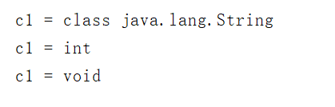
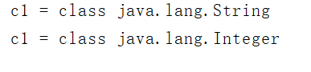

# **反射机制**

# **1.1** ***基本概念***

- 通常情况下编写代码都是固定的，无论运行多少次执行的结果也是固定的，在某些特殊场合中编写  代码时不确定要创建什么类型的对象，也不确定要调用什么样的方法，这些都希望通过运行时传递的参数来决定，该机制叫做动态编程技术，也就是反射机制。
- 通俗来说，反射机制就是用于动态创建对象并且动态调用方法的机制，也就是在运行阶段来决定创建什么对象，调用什么方法。目前主流的框架底层都是采用反射机制实现的。

​     如：

​      Person p = new Person(); - 表示声明Person类型的引用指向Person类型的对象

​      p.show();	- 表示调用Person类中的成员方法show

# **1.2** ***Class******类***

## **1.2.1** ***基本概念***

- java.lang.Class类的实例可以用于描述Java应用程序中的类和接口，也就是一种数据类型。
- 该类没有公共构造方法，该类的实例由Java虚拟机和类加载器自动构造完成，本质上就是加载到内存中的**运行时类。**

## **1.2.2** ***获取******Class******对象的方式***

- 使用数据类型.class的方式可以获取对应类型的Class对象（掌握）。

  ```java
  public class ClassTest {
      public static void main(String[] args) {
          //1.使用数据类型.calss的方式可以获取对应类型的Class对象
          Class c1 = String.class;
          System.out.println( "c1 = "+ c1);
          c1 = int.class;
          System.out.println( "c1 = "+ c1);
          c1 = void.class;
          System.out.println( "c1 = "+ c1);
      }
  }
  ```

  运行结果：

  

  ​      `如果此`类`对象表示基本类型，则此方法返回基本类型的名称。  如果此`类`对象表示void，则此方法返回“void”。  如果此`类`对象表示数组类型，则此方法返回“class”，后跟`getName` 。 

- 使用引用/对象.getClass()的方式可以获取对应类型的Class对象。（不能使用基本数据类型）

  ```java
  String str1 = new String("hello");
  c1 = str1.getClass();
  System.out.println("c1 = " + c1);
  
  Integer it1 = 20;
  c1 = it1.getClass();
  System.out.println("c1 = " + c1);
  ```

  运行结果：

  

- 使用包装类.TYPE的方式可以获取对应基本数据类型的Class对象。

  ```java
  c1 = Integer.TYPE;
  System.out.println("c1 = " + c1);
  ```

  运行结果：

  

- 使用Class.forName()的方式来获取参数指定类型的Class对象（掌握）。

  ```java
  c1 = Class.forName("java.lang.String");
  System.out.println("c1 = " + c1);
  ```

  注意：这里的Class.forName(里面的必须写完整）  包名.类名

  - 使用类加载器ClassLoader的方式获取指定类型的Class对象。

    ```java
     //获取类加载器
     ClassLoader classLoader = ClassTest.class.getClassLoader();
    c1 = classLoader.loadClass("java.lang.String");
     System.out.println("c1 = " + c1);
    ```

- 注意：一个类只有被JVM加载后才能使用，需要经过加载-->验证-->准备-->解析-->初始化五个阶段。
  当类被虚拟机加载后都会在内存中创建一个该类的Class对象，用于存储该类的各种信息。
  Class类的构造函数被设计为私有的，这意味着我们不能通过new的方式来创建Class对象，只有JVM才能创建该类的实例。因为类的加载不是我们负责的，只有JVM才知道如何加载一个类。

  

## **1.2.3** ***常用的方法（掌握）***

| **方法声明**                              | **功能介绍**                              |
| ----------------------------------------- | ----------------------------------------- |
| static Class<?> forName(String className) | 用于获取参数指定类型对应的Class对象并返回 |
| T newInstance()                           | 用于创建该Class对象所表示类的新实例       |

```java
//使用反射机制以无参形式构造Person类型对象并打印
Class c1 = Class.forName("com.cuiwei.demo.Person");
System.out.println("无参方式创建的对象是：" + c1.newInstance());
```

在开发中一般是使用读取配置文件的方式，不会选择在键盘输入所要创建的对象。

# 1.3 **Constructor**类

## **1.3.1** **基本概念**

- java.lang.reflect.Constructor类主要用于描述获取到的构造方法信息

## **1.3.2** ***Class******类的常用方法***

| **方法声明**                                           | **功能介绍**                                                 |
| ------------------------------------------------------ | ------------------------------------------------------------ |
| Constructor getConstructor(Class<?>... parameterTypes) | 用于获取此Class对象所表示类型中参数指定的公共构造方法（意思就是如果Clsass对象代表Person类型的对象，那么拿到的就是Person的构造方法） |
| Constructor<?>[] getConstructors()                     | 用于获取此Class对象所表示类型中所有的公共构造方法            |

## **1.3.3** **Constructor**类的常用方法

| **方法声明**                      | **功能介绍**                                                 |
| --------------------------------- | ------------------------------------------------------------ |
| T newInstance(Object... initargs) | 使用此Constructor对象描述的构造方法来构造Class对象代表类型的新实例 |
| int getModifiers()                 | 获取方法的访问修饰符                                         |
| String getName()                  | 获取方法的名称                                               |
| Class<?>[] getParameterTypes()    | 获取方法所有参数的类型                                       |

```java
  Class c1 = Class.forName("com.cuiwei.demo.Person");
  //获取Class对象对应类型中的无参构造方法，也就是Person类型的无参构造方法
  Constructor constructor = c1.getConstructor();
//使用获取到的无参构造方法来构造对应类型的对象，也就是Person对象
  System.out.println("无参方式创建的对象为：" + constructor.newInstance());
```

上述代码的顺序是，先拿到内存中的该类的运行实例信息，然后再拿到该类中的无参构造方法，再用该构造方法创建对象。

```java
 Class c1 = Class.forName("com.cuiwei.demo.Person");
  //获取Class对象对应类型中的有参构造方法，也就是Person类型中的有参数构造方法
 Constructor constructor1 = c1.getConstructor(int.class,String.class);
 //使用获取到的有参构造方法来构造对应类型的对象，也就是Person对象
 System.out.println("使用有参构造方法创建的对象为：" + constructor1.newInstance(10,"cuiwei"));

```

newInstance方法中的实参是用于给有参构造方法中的形参进行初始化的。

# **1.4** **Field**类

## **1.4.1** **基本概念**

java.lang.reflect.Field类主要用于描述获取到的单个成员变量信息。

## **1.4.2** Class类的常用方法

| **方法声明**                        | **功能介绍**                                            |
| ----------------------------------- | ------------------------------------------------------- |
| Field getDeclaredField(String name) | 用于获取此Class对象所表示类中参数指定的单个成员变量信息 |
| Field[] getDeclaredFields()         | 用于获取此Class对象所表示类中所有成员变量信息           |

### **1.4.3** **Field**类的常用方法

| **方法声明**                       | **功能介绍**                                                 |
| ---------------------------------- | ------------------------------------------------------------ |
| Object get(Object obj)             | 获取参数对象obj中此Field对象所表示成员变量的数值             |
| void set(Object obj, Object value) | 将参数对象obj中此Field对象表示成员变量的数值修改为参数value的数值 |
| void setAccessible(boolean flag)    | 当实参传递true时，则反射对象在使用时应该取消 Java 语言访问检查 |
| int getModifiers()                  | 获取成员变量的访问修饰符                                     |
| Class<?> getType()                 | 获取成员变量的数据类型                                       |
| String getName()                   | 获取成员变量的名称                                           |

# **1.5** **Method**类

## **1.5.1** **基本概念**

- java.lang.reflect.Method类主要用于描述获取到的单个成员方法信息。

## **1.5.2** ***Class******类的常用方法***

| **方法声明**                                              | **功能介绍**                                                 |
| --------------------------------------------------------- | ------------------------------------------------------------ |
| Method getMethod(String name, Class<?>... parameterTypes) | 用于获取该Class对象表示类中名字为name参数为parameterTypes的指定公共成员方法 |
| Method[] getMethods()                                     | 用于获取该Class对象表示类中所有公共成员方法                  |

## **1.5.3** **Method**类的常用方法

| **方法声明**                              | **功能介绍**                                                |
| ----------------------------------------- | ----------------------------------------------------------- |
| Object invoke(Object obj, Object... args) | 使用对象obj来调用此Method对象所表示的成员方法，实参传递args |
| int getModifiers()                         | 获取方法的访问修饰符                                        |
| Class<?> getReturnType()                  | 获取方法的返回值类型                                        |
| String getName()                          | 获取方法的名称                                              |
| Class<?>[] getParameterTypes()            | 获取方法所有参数的类型                                      |
| Class<?>[] getExceptionTypes()            | 获取方法的异常信息                                          |

```java
//获取Class对象对应类型中的有参构造方法，也就是Person类型中的有参数构造方法
Constructor constructor1 = c1.getConstructor(int.class,String.class);
//使用获取到的有参构造方法来构造对应类型的对象，也就是Person对象
Object cuiwei = constructor1.newInstance(10, "datou");
System.out.println("使用有参构造方法创建的对象为：" +    cuiwei);
//获取到成员方法getName()方法
Method getName = c1.getMethod("getName");
//用拿到的getName()方法来拿到姓名
Object invoke = getName.invoke(cuiwei);
System.out.println(invoke);
```

```java
 //使用反射机制以无参形式构造Person类型对象并打印
  Class c1 = Class.forName("com.cuiwei.demo.Person");
/*  //获取Class对象对应类型中的无参构造方法，也就是Person类型的无参构造方法
  Constructor constructor = c1.getConstructor();
//使用获取到的无参构造方法来构造对应类型的对象，也就是Person对象
  System.out.println("无参方式创建的对象为：" + constructor.newInstance());*/

  //获取Class对象对应类型中的有参构造方法，也就是Person类型中的有参数构造方法
  Constructor constructor1 = c1.getConstructor(int.class,String.class);
  //使用获取到的有参构造方法来构造对应类型的对象，也就是Person对象
  Object cuiwei = constructor1.newInstance(10, "datou");
  System.out.println("使用有参构造方法创建的对象为：" +    cuiwei);
  Method getName = c1.getMethod("getName");
  Object invoke = getName.invoke(cuiwei);
  System.out.println(invoke);
  System.out.println("----------------------------");

  Method[] methods = c1.getMethods();
  for (Method method : methods) {
      System.out.println("成员方法的修饰符为：" + method.getModifiers());
      System.out.println("成员方法的返回值为：" + method.getReturnType());
      System.out.println("成员方法的名称为：" + method.getName());
      System.out.println("成员方法的形参列表类型为：");
      Class<?>[] parameterTypes = method.getParameterTypes();
      for (Class<?> parameterType : parameterTypes) {
          System.out.println(parameterType + "");
      }
      System.out.println("成员方法的异常类型列表为：");
      Class<?>[] exceptionTypes = method.getExceptionTypes();
      for (Class<?> exceptionType : exceptionTypes) {
          System.out.println(exceptionType);
      }
  }
```

# **1.6** **获取其它结构信息**

| **方法声明**                     | **功能介绍**       |
| -------------------------------- | ------------------ |
| Package getPackage()             | 获取所在的包信息   |
| Class<? super T> getSuperclass() | 获取继承的父类信息 |
| Class<?>[] getInterfaces()       | 获取实现的所有接口 |
| Annotation[] getAnnotations()    | 获取注解信息       |
| Type[] getGenericInterfaces()    | 获取泛型信息       |

 