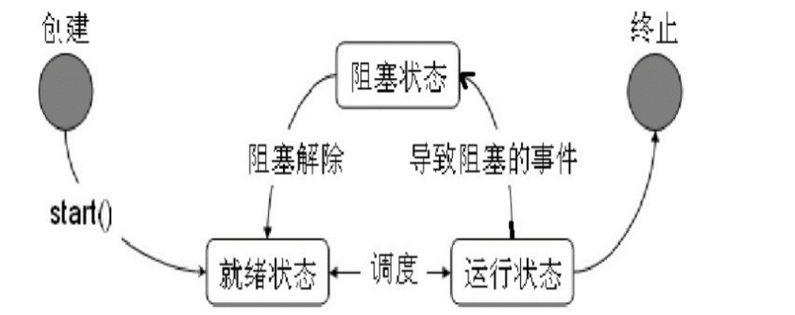

# 多线程

# **1.1** ***基本概念***

## **1.1.1** ***程序和进程的概念***

- 程序 - 数据结构 + 算法，主要指存放在**硬盘**上的可执行文件。
- 进程 - 主要指运行在**内存**中的可执行文件。也就是.exe文件
- 目前主流的操作系统都支持多进程，为了让操作系统同时可以执行多个任务，但进程是重量级的，也就是新建一个进程会消耗CPU和内存空间等系统资源，因此进程的数量比较局限。

## **1.1.2** ***线程的概念***

- 为了解决上述问题就提出线程的概念，线程就是进程内部的程序流，也就是说操作系统内部支持多 进程的，而每个进程的内部又是支持多线程的，线程是轻量的，新建线程会共享所在进程的系统资源，因此目前主流的开发都是采用多线程。
- 多线程是采用时间片轮转法来保证多个线程的并发执行，所谓并发就是指宏观并行微观串行的机制。

# **1.2** ***线程的创建（重中之重）***

## **1.2.1** ***Thread*****类的概念**

- java.lang.Thread类代表线程，任何线程对象都是Thread类（子类）的实例。  
-  Thread类是线程的模板，封装了复杂的线程开启等操作，封装了操作系统的差异性。

## **1.2.2** 创建方式

自定义类继承Thread类并重写run方法，然后创建该类的对象调用start方法。

自定义类实现Runnable接口并重写run方法，创建该类的对象作为实参来构造Thread类型的对象，然后使用Thread类型的对象调用start方法。

## **1.2.3** ***相关的方法***

| **方法声明**                         | **功能介绍**                                                 |
| ------------------------------------ | ------------------------------------------------------------ |
| Thread()                             | 使用无参的方式构造对象                                       |
| Thread(String name)                  | 根据参数指定的名称来构造对象                                 |
| Thread(Runnable target)              | 根据参数指定的引用来构造对象，其中Runnable是个接口类型       |
| Thread(Runnable target, String name) | 根据参数指定引用和名称来构造对象                             |
| void run()                           | 若使用Runnable引用构造了线程对象，调用该方法时最终调用接口中的版本，若没有使用Runnable引用构造线程对象，调用该方法时则啥也不做 |
| void start()                         | 用于启动线程，Java虚拟机会**自动调用该线程的run方法**  调用该方法相当于又启动了一个线程 |

使用无参构造Thread对象，run方法啥也不干。(所以要继承Thread类)

```java
//1.使用无参方式构造thread类型对象
//由源码可知，Thread类中的成员变量target的数值为NULL
Thread t1 = new Thread();
//2.调用run方法进行测试
//有源码可知，由于成员变量target的数值为NULL，因此条件if（target!=null）不成立，跳过不执行，run方法啥也不干。
t1.run();
//3.调用一句话
System.out.println("我想看看你到底干啥了！");
```

## **1.2.4** **执行流程**

- 执行main方法的线程叫做主线程，执行run方法的线程叫做新线程/子线程。
- main方法是程序的入口，对于start方法之前的代码来说，由主线程执行一次，当start方法调用成   功后线程的个数由1个变成了2个，新启动的线程去执行run方法的代码，主线程继续向下执行，两个线程各自独立运行互不影响。
- 当run方法执行完毕后子线程结束，当main方法执行完毕后主线程结束。 
-  两个线程执行没有明确的先后执行次序，**由操作系统调度算法来决定。**

## **1.2.5** ***方式的比较***

- 继承Thread类的方式代码简单，但是若该类继承Thread类后则无法继承其它类，而实现 Runnable接口的方式代码复杂，但不影响该类继承其它类以及实现其它接口，因此以后的开发中   推荐使用第二种方式。

- 第二种方式的代码：

- ```java
  public class SubRunnnableRun implements Runnable {
      @Override
      public void run() {
          for(int i =0;i<20;i++){
              System.out.println("run方法中：i= " + i);
          }
      }
  }
  ```

- 

  ```java
      public class SubRunnableRunTest {
          public static void main(String[] args) {
              //1.创建自定义类的对象，也就是实现Runnable接口的类对象
              SubRunnnableRun srr = new SubRunnnableRun();
              //2.使用该对象作为实参构造Thread类型的对象
              Thread t1 = new Thread(srr);
              //3.使用Thread类型的对象调用start方法
              t1.start();
          }
  }
  ```

这里为什么要创建Thread对象，这是因为你要调用start方法，而start方法是Thread类中的方法，所以创建以后才能使用。

## **1.2.6** ***匿名内部类的方式***

使用匿名内部类的方式来创建和启动线程。

 匿名内部类的语法格式：父类/接口类型  引用变量名 = new 父类/接口类型（）{方法的重写}

```java
//匿名内部类的语法格式：父类/接口类型  引用变量名 = new 父类/接口类型（）{方法的 重写}
//1.使用继承+匿名内部类的方式创建并启动线程
Thread t1 = new Thread(){
        @Override
public void run(){
            System.out.println("张三说：在吗？");
     }
};
t1.start();
//2.使用实现接口+匿名内部类的方式创建并启动线程
Runnable ra = new Runnable() {
    @Override
    public void run() {
        System.out.println("李四说：不在");
    }
};
Thread t2 = new Thread(ra);
t2.start();
```

# **1.3** ***线程的生命周期（熟悉）***

 

 

- 新建状态 -  使用new关键字创建之后进入的状态，此时线程并没有开始执行。
- 就绪状态 - 调用start方法后进入的状态，此时线程还是没有开始执行。
- 运行状态 -  使用线程调度器调用该线程后进入的状态，此时线程开始执行，当线程的时间片执行完毕后任务没有完成时回到就绪态。
- 消亡状态 - 当线程的任务执行完成后进入的状态，此时线程已经终止。
- 阻塞状态 -  当线程执行的过程中发生了阻塞事件进入的状态，如：sleep方法。阻塞状态解除后进入就绪状态。

 

# **1.4** ***线程的编号和名称（熟悉）***

| **方法声明**                  | **功能介绍**                        |
| ----------------------------- | ----------------------------------- |
| long getId()                  | 获取调用对象所表示线程的编号        |
| String getName()              | 获取调用对象所表示线程的名称        |
| void setName(String name)     | 设置/修改线程的名称为参数指定的数值 |
| static Thread currentThread() | 获取当前正在执行线程的引用          |

- 案例题目


自定义类继承Thread类并重写run方法，在run方法中先打印当前线程的编号和名称，然后将线程的名称修改为"zhangfei"后再次打印编号和名称。

要求在main方法中也要打印主线程的编号和名称。

 

```java
public class ThreadIdNameTest extends Thread {
    public ThreadIdNameTest(String name) {
        super(name);//表示调用父类的name
    }

    public void run(){
        System.out.println("子线程的编号是：" + getId() + ",名称是：" + getName());
        //修改名称为张飞
        setName("weicui");
        System.out.println("修改后子线程的编号是：" + getId() + ",名称是：" + getName());
    }


    public static void main(String[] args) {
        ThreadIdNameTest tint = new ThreadIdNameTest("cuiwei");
        tint.start();
        //获取当前正在执行的线程的引用  主线程
        Thread thread = Thread.currentThread();
        System.out.println("主线程的编号是：" + thread.getId() + ",名称为：" + thread.getName() );
    }
}
```

public ThreadIdNameTest(String name) {
        super(name);//表示调用父类的name
    }

这段代码的意思：使用构造方法给成员变量进行初始化，但是你没有成员变量，但是你继承了Thread类，super(name),是为了调用父类的构造方法。

补充super关键字：

当用子类的构造方法创建一个对象时，子类的构造方法总是先调用父类的某个构造方法；

2、当子类的构造方法没有明确地指明使用父类的哪个构造方法，那么子类就默认调用父类中不带参数的构造方法；

3、需要注意：当某个类中定义了一个或多个构造方法时，那么Java系统就不提供默认的无参数的构造方法了；

当子类的构造方法中没有 super() ; 关键字时，系统默认该方法有 super()，此时就调用了父类没有参数的构造方法；

当子类的构造方法中有 super(); 关键字时，系统就调用父类相应参数的构造方法；

super()调用的就是父类的无参构造方法，super(name)调用的就是具有相同形参的构造方法。this调用的是本类中的构造方法。

代码如下：

```java
//父类
public class superKeyword {
	//父类的成员变量
	int numberFa;
	//无参数构造方法
	superKeyword(){
		System.out.println("系统默认调用了父类无参数构造方法 ");
	} 
	superKeyword(int numberFa){
		this.numberFa = numberFa;
		System.out.println("父类的手机号码： "+numberFa);
	}
}
```

```java
//父类
public class superKeyword_Test extends superKeyword {
	//成员变量
	int age,number;
	double Fraction;
	
	//没有super();的情况时，系统默认该方法有 super()，此时就调用了父类没有参数的构造方法
	superKeyword_Test(int age,int number){
		this.age = age;
		this.number = number;
		System.out.println("子类的年龄："+age+" 子类的手机号码： "+number+"\n");
	}
 
	//有super();的情况时，系统就调用父类相应参数的构造方法
	superKeyword_Test(double Fraction, int number) {
		super(117330111);
		this.Fraction = Fraction;
		this.number = number;
		System.out.println("子类的分数："+Fraction+" 子类的手机号码： "+number);
	}
	
   public static void main(String[] args){
	   //调用没有super()的构造方法
	   superKeyword_Test skt = new superKeyword_Test(18,117120);  
           //调用有super()的构造方法
	   superKeyword_Test skt1 = new superKeyword_Test(111.11,117110);     
   }
}
```


# **1.5** ***常用的方法（重点）***

| **方法声明**                      | **功能介绍**                                                 |
| --------------------------------- | ------------------------------------------------------------ |
| static void yield()               | 当前线程让出处理器（离开Running状态），使当前线程进入Runnable 状态等待 |
| static void sleep(times)          | 使当前线程从 Running 放弃处理器进入Block状态, 休眠times毫秒, 再返回到Runnable如果其他线程打断当前线程的Block(sleep), 就会发生InterruptedException。  进入阻塞状态 |
| int getPriority()                 | 获取线程的优先级                                             |
| void setPriority(int newPriority) | 修改线程的优先级。优先级越高的线程不一定先执行，**但该线程获取到时间片的机会会更多一些** |
| void join()                       | 等待该线程终止                                               |
| void join(long millis)            | 等待参数指定的毫秒数                                         |
| boolean isDaemon()                | 用于判断是否为守护线程                                       |
| void setDaemon(boolean on)        | 用于设置线程为守护线程                                       |

- sleep方法：

```java
public class ThreadSleepTest extends Thread {
  private boolean flag = true;
    //这里的Sleep方法只能try catch，是因为子类中不能再抛出更大的异常
    public void run(){
        //每隔一秒，获取一次系统时间
        while(flag){
            Date d1 = new Date();
            SimpleDateFormat s1 = new SimpleDateFormat("yyyy-MM-dd HH-mm-ss");
            String format = s1.format(d1);
            System.out.println(format);

            //睡眠一秒
            try {
                Thread.sleep(1000);
            } catch (InterruptedException e) {
                e.printStackTrace();
            }
        }
    }

    public static void main(String[] args) {
        ThreadSleepTest t1 = new ThreadSleepTest();
        t1.start();

        //主线程等待5秒后结束子线程
        System.out.println("主线程开始等待");
        try {
            Thread.sleep(5000);
        } catch (InterruptedException e) {
            e.printStackTrace();
        }
        System.out.println("主线程结束");
        /*t1.stop();*/
        t1.flag = false;
    }
}
```

join方法：

```java
public class ThreadJoinTest extends Thread {
    @Override
    public void run() {
        // 模拟倒数10个数的效果
        System.out.println("倒计时开始...");
        for (int i = 10; i > 0; i--) {
            System.out.println(i);
            try {
                Thread.sleep(1000);
            } catch (InterruptedException e) {
                e.printStackTrace();
            }
        }
        System.out.println("新年快乐！");
    }

    public static void main(String[] args) {

        ThreadJoinTest tjt = new ThreadJoinTest();
        tjt.start();

        // 主线程开始等待
        System.out.println("主线程开始等待...");
        try {
            // 表示当前正在执行的线程对象等待调用线程对象，也就是主线程等待子线程终止
            //tjt.join();
            tjt.join(5000); // 最多等待5秒
        } catch (InterruptedException e) {
            e.printStackTrace();
        }
        //System.out.println("终于等到你，还好没放弃！");
        System.out.println("可惜不是你，陪我到最后！");
    }
}

```

注意：

守护线程就是服务其他线程的线程。

当子线程不是守护线程时，虽然主线程先结束了，但是子线程依然会继续执行，直到打印完毕数据为止

当子线程是守护线程时，当主线程结束后，子线程随之结束。

- 案例题目


编程创建两个线程，线程一负责打印1 ~ 100之间的所有奇数，其中线程二负责打印1 ~ 100之间的所有偶数。

在main方法启动上述两个线程同时执行,主线程等待两个线程终止。

 

# **1.6** ***线程同步机制（重点）***

## **1.6.1** ***基本概念***

- 当多个线程同时访问同一种共享资源时，可能会造成数据的覆盖等不一致性问题，此时就需要对线程之间进行通信和协调，该机制就叫做线程的同步机制。
- 多个线程并发读写同一个临界资源时会发生线程并发安全问题。异步操作:多线程并发的操作，各自独立运行。
- 同步操作:多线程串行的操作，先后执行的顺序。

## **1.6.2** ***解决方案***

模拟银行取款操作：

```java
public class AccountRunnableTest  implements Runnable {

    private int Balance;

    public int getBalance() {
        return Balance;
    }

    public void setBalance(int balance) {
        Balance = balance;
    }

    public AccountRunnableTest() {
    }
    
    public AccountRunnableTest(int balance) {
        Balance = balance;
    }
    @Override
    public void run() {
        //模拟从后台查询账户余额的进程
        int temp = getBalance();
        //模拟取走200元
        if(temp >=200){
            System.out.println("正在出钞，请稍等");
            temp = temp-200;
            try {
                Thread.sleep(5000);
            } catch (InterruptedException e) {
                e.printStackTrace();
            }
            System.out.println("请取走您的钞票");
        }else{
            System.out.println("余额不足，请核对您的账户余额");
        }
        //3.请模拟将最新的账户余额写入后台
        setBalance(temp);
    }


    public static void main(String[] args) {
        AccountRunnableTest account  = new AccountRunnableTest(1000);
        Thread t1 = new Thread(account);
        Thread t2 = new Thread(account);
        t1.start();
        t2.start();
        System.out.println("主线程开始等待。。。。");
        try {
            t1.join();
            t2.join();
        } catch (InterruptedException e) {
            e.printStackTrace();
        }
        System.out.println("最终的余额为：" + account.getBalance());
    }
}
```

运行结果：


- 由程序结果可知：当两个线程同时对同一个账户进行取款时，导致最终的账户余额不合理。   
- 引发原因：线程一执行取款时还没来得及将取款后的余额写入后台，线程二就已经开始取款。
- 解决方案：让线程一执行完毕取款操作后，再让线程二执行即可，将线程的并发操作改为串行操作。
- 经验分享：在以后的开发尽量减少串行操作的范围，从而提高效率。

## **1.6.3** ***实现方式***

在Java语言中使用synchronized关键字来实现同步/对象锁机制从而保证线程执行的原子性（使用该关键字，可以实现只能让一个线程进入，直到该线程结束自动解锁，然后才能让下一个线程进入），具体方式如下：

- 使用同步代码块的方式实现**部分代码**的锁定，格式如下：


```java
synchronized(类类型的引用)  {

    编写所有需要锁定的代码；

}
```

```java
synchronized (demo) {
    //模拟从后台查询账户余额的进程
    int temp = getBalance();
    //模拟取走200元
    if(temp >=200){
        System.out.println("正在出钞，请稍等");
        temp = temp-200;
        try {
            Thread.sleep(5000);
        } catch (InterruptedException e) {
            e.printStackTrace();
        }
        System.out.println("请取走您的钞票");
    }else{
        System.out.println("余额不足，请核对您的账户余额");
    }
    //3.请模拟将最新的账户余额写入后台
    setBalance(temp);
}
```

synchronized (demo) 可以锁住，synchronized (new Demo) 锁不住，因为前一个是一把锁，后一个每来一个线程都会创建一把锁。

- 使用同步方法的方式实现**所有代码**的锁定。

  ```java
  public synchronized void run()
  ```

直接使用synchronized关键字来修饰整个方法即可该方式等价于:

​					synchronized(this) { 整个方法体的代码 }

## **1.6.4** ***静态方法的锁定***

- 当我们对一个静态方法加锁，如:

public synchronized static void xxx(){….}

- 那么该方法锁的对象是类对象。每个类都有唯一的一个类对象。
- 获取类对象的方式:类名.class。  静态方法与非静态方法同时使用了synchronized后它们之间是非互斥关系的。
- 原因在于：静态方法锁的是类对象而非静态方法锁的是当前方法所属对象。

## **1.6.5** ***注意事项***

- 使用synchronized保证线程同步应当注意:

1.  多个需要同步的线程在访问同步块时，看到的应该是同一个锁对象引用。
2. 在使用同步块时应当尽量减少同步范围以提高并发的执行效率。（锁定的代码越好越好）

## **1.6.6** ***线程安全类和不安全类***

- StringBuffer类是线程安全的类，但StringBuilder类不是线程安全的类。
- Vector类和 Hashtable类是线程安全的类，但ArrayList类和HashMap类不是线程安全的类。
- Collections.synchronizedList() 和 Collections.synchronizedMap()等方法实现安全。

## **18.6.7** ***死锁的概念***

- 线程一执行的代码：

线程一执行的代码：

public void run(){

 synchronized(a){ //持有对象锁a，等待对象锁b

 synchronized(b){

 编写锁定的代码;

​        }

​     }

}


- 线程二执行的代码：

public void run(){

 synchronized(b){ //持有对象锁b，等待对象锁a

 synchronized(a){

 编写锁定的代码;

​          }

​      }

}

注意：

在以后的开发中尽量减少同步的资源，减少同步代码块的嵌套结构的使用！

## **1.6.8** ***使用******Lock******（锁）实现线程同步***

### **（1）** ***基本概念***

- 从Java5开始提供了更强大的线程同步机制—使用显式定义的同步锁对象来实现。
- java.util.concurrent.locks.Lock接口是控制多个线程对共享资源进行访问的工具。
- 该接口的主要实现类是ReentrantLock类，该类拥有与synchronized相同的并发性，在以后的线程安全控制中，经常使用ReentrantLock类显式加锁和释放锁。

### **（2）** ***常用的方法***

| **方法声明**    | **功能介绍**         |
| --------------- | -------------------- |
| ReentrantLock() | 使用无参方式构造对象 |
| void lock()     | 获取锁               |
| void unlock()   | 释放锁               |

```java
ReentrantLock lock = new ReentrantLock(); //准备了一把锁
//加锁
lock.lock();
*
*     要加锁的代码
*
*
//释放锁
lock.unlock();
```

### **（3）** **与**synchronized方式的比较

- Lock是显式锁，需要手动实现开启和关闭操作，而synchronized是隐式锁，执行锁定代码后自动释放。
- Lock只有同步代码块方式的锁，而synchronized有同步代码块方式和同步方法两种锁。
- 使用Lock锁方式时，Java虚拟机将花费较少的时间来调度线程，因此性能更好。

## **1.6.9** ***Object******类常用的方法***

| **方法声明**            | **功能介绍**                                                 |
| ----------------------- | ------------------------------------------------------------ |
| void wait()             | 用于使得线程进入阻塞状态，直到其它线程调用notify()或notifyAll()方法 |
| void wait(long timeout) | 用于进入阻塞状态，直到其它线程调用方法或参数指定的毫秒数已经过去为止 |
| void notify()           | 用于唤醒阻塞的单个线程                                       |
| void notifyAll()        | 用于唤醒阻塞的所有线程                                       |

```java
public class ThreadCommunicateTest implements Runnable {

    private int cnt = 1;
    @Override
    public void run() {
        while (true) {
            synchronized (this) {
                //每当有一个线程进来后先叫醒另一个线程
                notify();
                if (cnt <= 100) {
                    
                    System.out.println("线程" + Thread.currentThread().getName() + "中：cnt = " + cnt);
                    try {
                        Thread.sleep(500);
                    } catch (InterruptedException e) {
                    }
                    cnt++;
                    //当前线程打印完毕一个整数后，为了防止继续打印下一个数据，调用wait()方法
                    try {
                        wait();
                    } catch (InterruptedException e) {
                        e.printStackTrace();
                    }
                } else {
                    break;
                }
            }
        }
    }


    public static void main(String[] args) {
        Runnable r1 = new ThreadCommunicateTest();
        Thread t1= new Thread(r1);
        t1.start();
        Thread t2 = new Thread(r1);
        t2.start();
    }
}
```

注意：wait和notify都必须在锁定的代码中通信。

## **1.6.10** **线程池（熟悉）**

### **（1）** ***实现******Callable******接口***

- 从Java5开始新增加创建线程的第三种方式为实现java.util.concurrent.Callable接口。
- 常用的方法如下：

| **方法声明** | **功能介绍**   |
| ------------ | -------------- |
| V call()     | 计算结果并返回 |

### **（2）** ***FutureTask******类***

- java.util.concurrent.FutureTask类用于描述可取消的异步计算，该类提供了Future接口的基本实现，包括启动和取消计算、查询计算是否完成以及检索计算结果的方法，也可以用于获取方法调用  后的返回结果。
- 常用的方法如下：

| **方法声明**                  | **功能介绍**                         |
| ----------------------------- | ------------------------------------ |
| FutureTask(Callable callable) | 根据参数指定的引用来创建一个未来任务 |
| V get()                       | 获取call方法计算的结果               |

### **（3）** ***线程池的由来***

- 在服务器编程模型的原理，每一个客户端连接用一个单独的线程为之服务，当与客户端的会话结束时，线程也就结束了，即每来一个客户端连接，服务器端就要创建一个新线程。
- 如果访问服务器的客户端很多，那么服务器要不断地创建和销毁线程，这将严重影响服务器的性能。

### **（4）** ***概念和原理***

- 线程池的概念：首先创建一些线程，它们的集合称为线程池，当服务器接受到一个客户请求后，就从线程池中取出一个空闲的线程为之服务，服务完后不关闭该线程，而是将该线程还回到线程池中。
- 在线程池的编程模式下，任务是提交给整个线程池，而不是直接交给某个线程，线程池在拿到任务后，它就在内部找有无空闲的线程，再把任务交给内部某个空闲的线程，任务是提交给整个线程池，一个线程同时只能执行一个任务，但可以同时向一个线程池提交多个任务。

### **（5）** ***相关类和方法***

- 从Java5开始提供了线程池的相关类和接口：java.util.concurrent.Executors类和
- java.util.concurrent.ExecutorService接口。
- 其中Executors是个工具类和线程池的工厂类，可以创建并返回不同类型的线程池，常用方法如下：

| **方法声明**                                            | **功能介绍**                         |
| ------------------------------------------------------- | ------------------------------------ |
| static ExecutorService newCachedThreadPool()            | 创建一个可根据需要创建新线程的线程池 |
| static ExecutorService newFixedThreadPool(int nThreads) | 创建一个可重用固定线程数的线程池     |
| static ExecutorService newSingleThreadExecutor()        | 创建一个只有一个线程的线程池         |

- 其中ExecutorService接口是真正的线程池接口，主要实现类是ThreadPoolExecutor，常用方法  如下：

| **方法声明**                   | **功能介绍**                         |
| ------------------------------ | ------------------------------------ |
| void execute(Runnable command) | 执行任务和命令，通常用于执行Runnable |
| Future submit(Callable task)   | 执行任务和命令，通常用于执行Callable |
| void shutdown()                | 启动有序关闭                         |

```java
public class ThreadPoolTest {

    public static void main(String[] args) {

        // 1.创建一个线程池
        ExecutorService executorService = Executors.newFixedThreadPool(10);
        // 2.向线程池中布置任务
        executorService.submit(new ThreadCallableTest());
        // 3.关闭线程池
        executorService.shutdown();
    }
}
```

