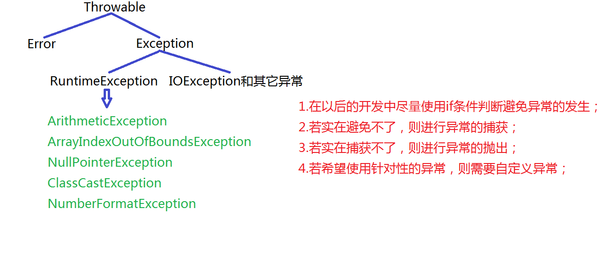

#  异常机制和**File**类


# **1.1** ***异常机制（重点）***

- thrwos 。 是抛给了你的上一级（调用者）。这个异常我处理不了或者不知道怎么处理时使用。
- try catch代码块 。是自己处理异常，不用再抛出去，因为自己都能处理的异常抛出去没意义了。

## **1.1.1** ***基本概念***

- 异常就是"不正常"的含义，在Java语言中主要指程序执行中发生的不正常情况。
- java.lang.Throwable类是Java语言中错误(Error)和异常(Exception)的超类。
- 其中Error类主要用于描述Java虚拟机无法解决的严重错误，通常无法编码解决，如：JVM挂掉了   等。
- 其中Exception类主要用于描述因编程错误或偶然外在因素导致的轻微错误，通常可以编码解决， 如：0作为除数等。

## **1.1.2** ***异常的分类***

- java.lang.Exception类是所有异常的超类，主要分为以下两种： RuntimeException - 运行时异常，也叫作非检测性异常
- IOException和其它异常 - 其它异常，也叫作检测性异常，所谓检测性异常就是指在编译阶段都能被编译器检测出来的异常。

其 中 RuntimeException 类 的 主 要 子 类 ： ArithmeticException类 - 算术异常ArrayIndexOutOfBoundsException类 - 数组下标越界异常NullPointerException - 空指针异常

ClassCastException - 类型转换异常

NumberFormatException - 数字格式异常

- 注意：

当程序执行过程中发生异常但又没有手动处理时，则由Java虚拟机采用默认方式处理异常，而默认处理方式就是：打印异常的名称、异常发生的原因、异常发生的位置以及终止程序。

## **1.1.3** ***异常的避免***

在以后的开发中尽量使用if条件判断来避免异常的发生。

但是过多的if条件判断会导致程序的代码加长、臃肿，可读性差。



语法格式：

```
try {

编写可能发生异常的代码;

}

catch(异常类型 引用变量名) {

编写针对该类异常的处理代码；

}

...

finally {

编写无论是否发生异常都要执行的代码；

}
```

注意事项：

a.当需要编写多个catch分支时，切记小类型应该放在大类型的前面； 

b.懒人的写法：

catch(Exception e) {}

c.finally通常用于进行善后处理，如：关闭已经打开的文件等。执行流程

```
try { a;

b; - 可能发生异常的语句

c;

}catch(Exception ex) { 
d;

}finally { e;

}
```

当没有发生异常时的执行流程：a b c e;

当发生异常时的执行流程：a b d e;

## **1.1.5** ***异常的抛出***

- 基本概念

在某些特殊情况下有些异常不能处理或者不便于处理时，就可以将该异常转移给该方法的调用者，  这种方法就叫异常的抛出。当方法执行时出现异常，则底层生成一个异常类对象抛出，此时异常代  码后续的代码就不再执行。

- 语法格式

访问权限 返回值类型 方法名称(形参列表) throws 异常类型1,异常类型2,...{ 方法体; }

如：

public void show() throws IOException{}

- 方法重写的原则

a.要求方法名相同、参数列表相同以及返回值类型相同，从jdk1.5开始支持返回子类类型；

 b.要求方法的访问权限不能变小，可以相同或者变大；

c.要求方法不能抛出更大的异常；

- 注意：

子类重写的方法不能抛出更大的异常、不能抛出平级不一样的异常，但可以抛出一样的异常、更小  的异常以及不抛出异常。

- 经验分享

若父类中被重写的方法没有抛出异常时，则子类中重写的方法只能进行异常的捕获处理。   若一个方法内部又以递进方式分别调用了好几个其它方法，则建议这些方法内可以使用抛出 的方法处理到最后一层进行捕获方式处理。

## **1.1.6** ***自定义异常***

- 基本概念

当需要在程序中表达年龄不合理的情况时，而Java官方又没有提供这种针对性的异常，此时就需要程序员自定义异常加以描述。

- 实现流程

a. 自定义xxxException异常类继承Exception类或者其子类。

b. 提供两个版本的构造方法，一个是无参构造方法，另外一个是字符串作为参数的构造方法。 异常的产生

throw new 异常类型(实参);

如：

throw new AgeException("年龄不合理！！！");

Java采用的异常处理机制是将异常处理的程序代码集中在一起，与正常的程序代码分开，使得程序简洁、优雅，并易于维护。

# **1.2** ***File******类（重点）***


## **1.2.1** ***基本概念***

java.io.File类主要用于描述文件或目录路径的抽象表示信息，可以获取文件或目录的特征信息， 如：大小等。

## **1.2.2** ***常用的方法***

| **方法声明**                       | **功能概述**                                 |
| ---------------------------------- | -------------------------------------------- |
| File(String pathname)              | 根据参数指定的路径名来构造对象               |
| File(String parent, String child)  | 根据参数指定的父路径和子路径信息构造对象     |
| File(File parent, String child)    | 根据参数指定的父抽象路径和子路径信息构造对象 |
| boolean exists()                   | 测试此抽象路径名表示的文件或目录是否存在     |
| String getName()                   | 用于获取文件的名称                           |
| long length()                      | 返回由此抽象路径名表示的文件的长度           |
| long lastModified()                 | 用于获取文件的最后一次修改时间               |
| String getAbsolutePath()           | 用于获取绝对路径信息                         |
| boolean delete()                   | 用于删除文件，当删除目录时要求是空目录       |
| boolean createNewFile()            | 用于创建新的空文件                           |
| boolean mkdir()                    | 用于创建目录                                 |
| boolean mkdirs()                   | 用于创建多级目录                             |
| File[] listFiles()                 | 获取该目录下的所有内容                       |
| boolean isFile()                   | 判断是否为文件                               |
| boolean isDirectory()              | 判断是否为目录                               |
| File[] listFiles(FileFilter filter) | 获取目录下满足筛选器的所有内容               |

案例题目

遍历指定目录以及子目录中的所有内容并打印出来。